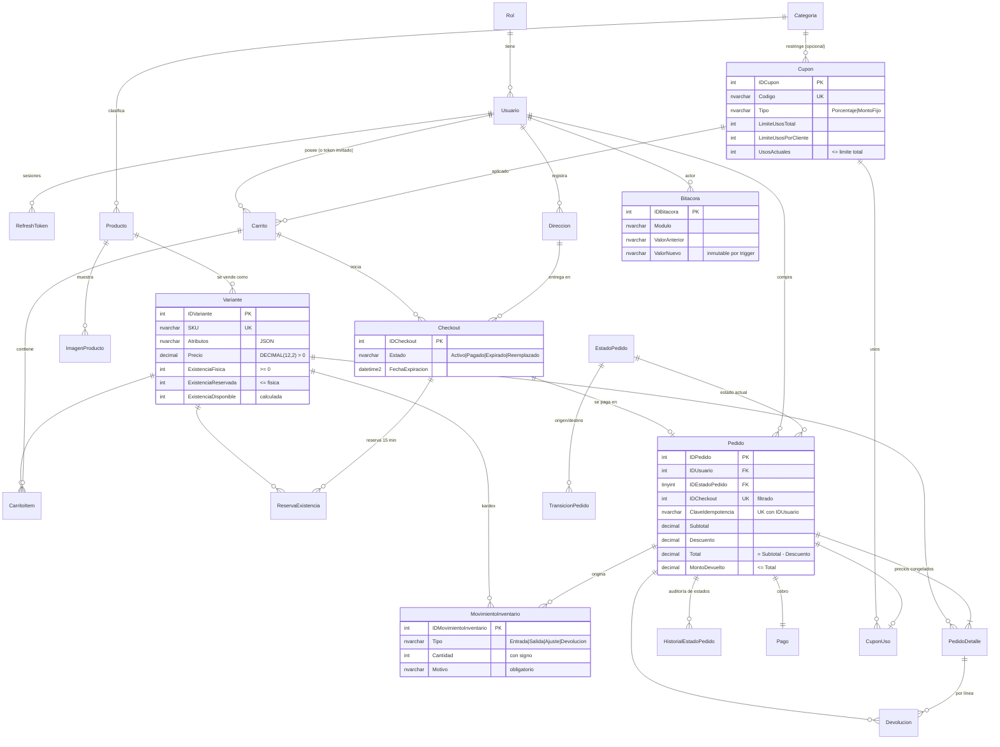

# Diagrama entidad-relación

```mermaid
erDiagram
    Rol ||--o{ Usuario : "tiene"
    Usuario ||--o{ RefreshToken : "sesiones"
    Usuario ||--o{ Direccion : "registra"
    Categoria ||--o{ Producto : "clasifica"
    Categoria ||--o{ Cupon : "restringe (opcional)"
    Producto ||--o{ Variante : "se vende como"
    Producto ||--o{ ImagenProducto : "muestra"
    Variante ||--o{ MovimientoInventario : "kardex"
    Variante ||--o{ CarritoItem : ""
    Variante ||--o{ ReservaExistencia : ""
    Variante ||--o{ PedidoDetalle : ""
    Usuario ||--o{ Carrito : "posee (o token invitado)"
    Cupon ||--o{ Carrito : "aplicado"
    Carrito ||--o{ CarritoItem : "contiene"
    Carrito ||--o{ Checkout : "inicia"
    Direccion ||--o{ Checkout : "entrega en"
    Checkout ||--o{ ReservaExistencia : "reserva 15 min"
    Checkout ||--o| Pedido : "se paga en"
    Usuario ||--o{ Pedido : "compra"
    EstadoPedido ||--o{ Pedido : "estado actual"
    EstadoPedido ||--o{ TransicionPedido : "origen/destino"
    Pedido ||--|{ PedidoDetalle : "precios congelados"
    Pedido ||--o{ HistorialEstadoPedido : "auditoría de estados"
    Pedido ||--|| Pago : "cobro"
    Pedido ||--o{ Devolucion : ""
    PedidoDetalle ||--o{ Devolucion : "por línea"
    Pedido ||--o{ MovimientoInventario : "origina"
    Cupon ||--o{ CuponUso : "usos"
    Pedido ||--o| CuponUso : ""
    Usuario ||--o{ Bitacora : "actor"

    Variante {
        int IDVariante PK
        nvarchar SKU UK
        nvarchar Atributos "JSON"
        decimal Precio "DECIMAL(12,2) > 0"
        int ExistenciaFisica ">= 0"
        int ExistenciaReservada "<= fisica"
        int ExistenciaDisponible "calculada"
    }
    Pedido {
        int IDPedido PK
        int IDUsuario FK
        tinyint IDEstadoPedido FK
        int IDCheckout UK "filtrado"
        nvarchar ClaveIdempotencia "UK con IDUsuario"
        decimal Subtotal
        decimal Descuento
        decimal Total "= Subtotal - Descuento"
        decimal MontoDevuelto "<= Total"
    }
    Checkout {
        int IDCheckout PK
        nvarchar Estado "Activo|Pagado|Expirado|Reemplazado"
        datetime2 FechaExpiracion
    }
    Cupon {
        int IDCupon PK
        nvarchar Codigo UK
        nvarchar Tipo "Porcentaje|MontoFijo"
        int LimiteUsosTotal
        int LimiteUsosPorCliente
        int UsosActuales "<= limite total"
    }
    MovimientoInventario {
        int IDMovimientoInventario PK
        nvarchar Tipo "Entrada|Salida|Ajuste|Devolucion"
        int Cantidad "con signo"
        nvarchar Motivo "obligatorio"
    }
    Bitacora {
        int IDBitacora PK
        nvarchar Modulo
        nvarchar ValorAnterior
        nvarchar ValorNuevo "inmutable por trigger"
    }
```
